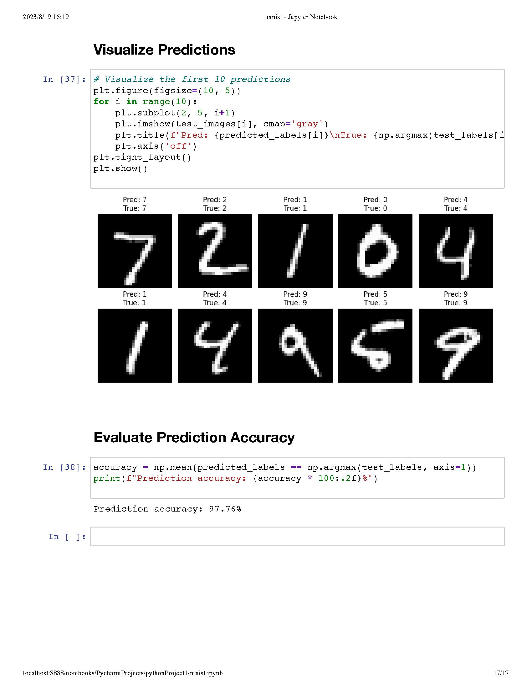
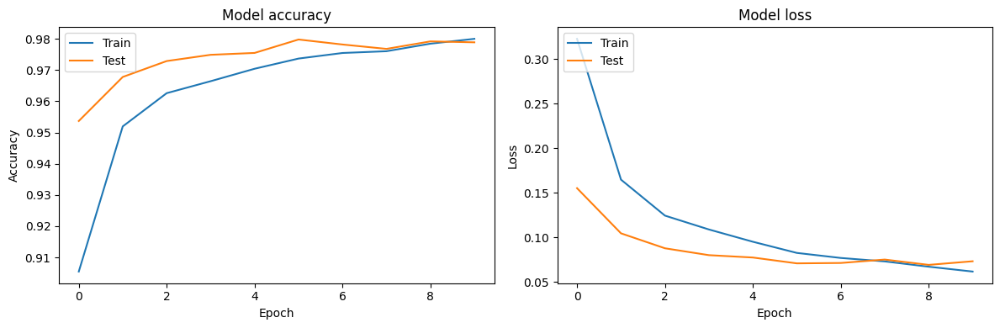

# HandWritten_Number_Recognition
Trying NLP





## after adding drop out, the accuracy slightly improved to 97.89%
```
it is already a generally good hand written digit prediction model considering the method we use

we could still improve if by using other methods like CNNs (卷积神经网络)

the model's graph is generally good, we dont step into overfitting and underfitting
```
## and we could still try many other ways to increase the accuracy like below:
```
Data Augmentation: For image data, you can use data augmentation to artificially increase the size of the training dataset. This involves making small modifications to the input images, like rotations, shifts, and zooms.

Reduce Model Complexity: Sometimes, simpler models with fewer parameters can generalize better to new data. Consider reducing the number of neurons or layers.

Cross-Validation: Use cross-validation to get a better estimate of the model's performance on unseen data.
```
